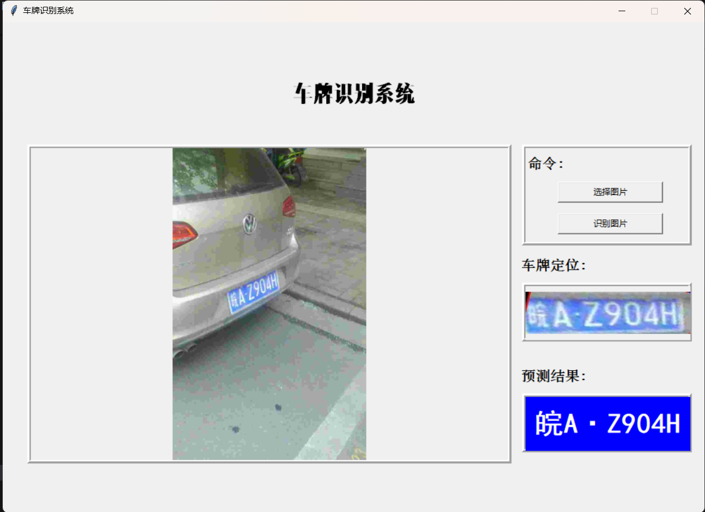
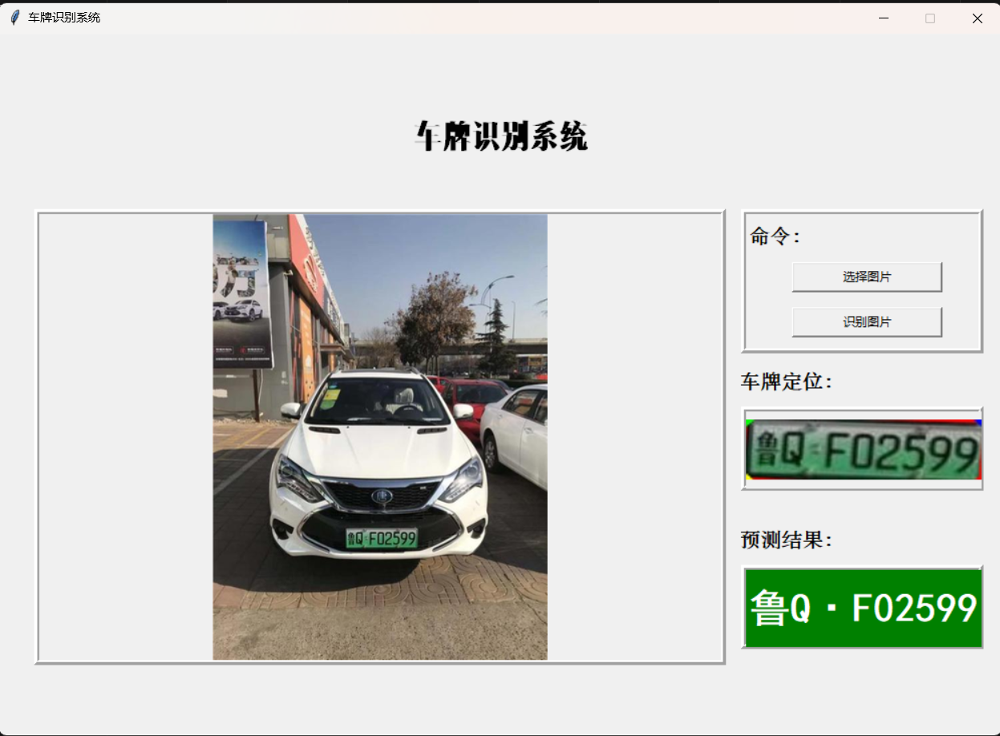

# License Plate Recognition Project

## Overview

This project focuses on developing a robust and efficient **License Plate Recognition (LPR)** system for real-world applications, such as toll collection, parking management, and traffic monitoring. Our approach integrates traditional computer vision techniques and modern deep learning methods, achieving high recognition accuracy on the **CCPD dataset**.

## Features

- **License Plate Localization:** Combines YOLO and RetinaNet for accurate bounding box detection and corner point extraction.
- **Color Recognition:** Employs HSV-based traditional methods for classifying license plate colors (blue, green, yellow).
- **Character Recognition:** Integrates ResNet-based models for segmented character recognition and RapidOCR for end-to-end OCR-based recognition.
- **Graphical User Interface (GUI):** A user-friendly Python-based GUI for real-time license plate recognition.

## Installation and Usage

### Step 1: Install Dependencies
Ensure Python is installed. Run the following command to install the required packages:
```bash
# 创建环境
conda env create -f environment.yml

# 激活环境（使用 yml 文件中定义的名称）
conda activate license_env
```

### Step 2: Run the GUI
Navigate to the src/ directory and execute the GUI script:
```bash
python ui.py
```

Alternatively, you can use the pre-built executable:
- Extract `final.zip`.
- Navigate to `dist/ui/` and run `ui.exe`.

### GUI Preview
Below are examples of the GUI in action:

|  |  |
|-----------------------------------|-----------------------------------|

## Results

Using the **YOLO + Retina + RapidOCR** pipeline, the system achieves:
- **96.09% accuracy** on 997 randomly sampled images from the CCPD validation set.

## Experimental Highlights

- **Localization:** YOLO provides fast and accurate bounding boxes, and RetinaNet refines the corner points for perspective correction.
- **Recognition:** RapidOCR offers robust recognition under challenging conditions, eliminating the need for character segmentation.
- **Challenges Addressed:**
  - Improved character segmentation by refining projection histograms and incorporating morphological operations.
  - Addressed difficulties with Chinese license plates and extreme environmental conditions.

## Further Information

For additional details about our approach, results, and analysis, refer to the [project documentation](License_Plate_Recognition_Project.pdf).

## Acknowledgments

We express gratitude to the authors and maintainers of:
- [YOLOv5](https://huggingface.co/keremberke/yolov5n-license-plate)
- [RetinaNet LPR Implementation](https://github.com/zxm97/RetinaFace_LPRNet_TensorRT)
- [RapidOCR](https://rapidai.github.io/RapidOCRDocs/)

## Future Work

- Extend support for special license plates (e.g., police, military).
- Enhance recognition performance for blurred and tilted plates.
- Optimize the pipeline for real-time processing.

---
Thank you for exploring our project!